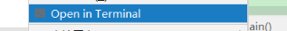
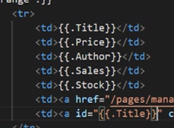
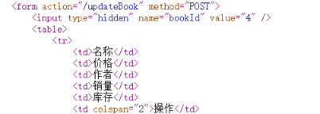
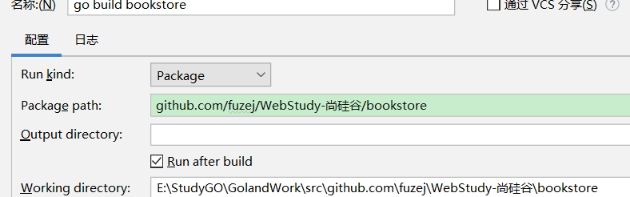
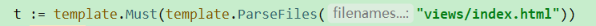

# 2.16
***     ***     ***     ***     ***
1. 一定要在main.go 的当前目录下写: （与GOPATH 无关）
    1.  
2.  相当于:
    1.  (*model.User)  ——》 (User user)
    2.  user := &model.User{} ——》    User user=new User()
    3.  func CheckUserName(username string) (*model.User, error) 
        ——》  public User CheckUserName(String username) 
    4.  t := template.Must(template.ParseFiles ——》 重定向
    5.  rows.Scan(&book.ID) ——》 resultset.set(user.getID()))
    6.  t.Execute(w, books) ——》
3.  panic(err.Error()) ——》 panic 和 logs 的区别 
4.  go Test的使用方法：
5.  {{range}} {{end}}
6.  怎么从前端传值
7.  
    1.  JQuery 获取模板 
8.  
    1. 查看网页源代码获取id
## 总结
***     ***     ***     ***     ***
|  Terminal        | 固定写法           | 单元格           |
|  ----         | ----             |----              |
|  go run : 编译main.go  | w            |单元格             |
| go install  :exe       |    testAdBc        |单元格              |
| Ctrl + C 停止      |  test 一定要在dao下      |单元格              |
| Ctrl + Alt + 右键 ——》 open Terminal|单元格           |单元格              |

***     ***     ***     ***     ***
1.  由WorkingPath 、Ctrl + Alt + 右键 打开Terminal 
和 Python Django ，cd ：到工作目录 app 的理解 ：

    1.  每个都需要工种目录 app
    2.  静态文件、、、
    3.  不同于java ： Go、Python静态文件没有部署到服务端     
        删除浏览器缓存后消失
    4.  绝对路径和相对路径

2.  后端的模板引擎跳转 和 Html页面跳转 理解:

    1.  a
    2.  asd
## 错误
***     ***     ***     ***     ***
1.

# 2.17

***     ***     ***     ***     ***
## 问题
